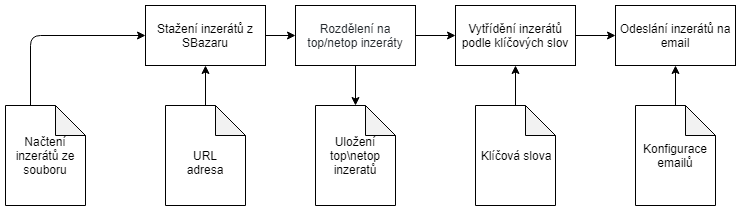
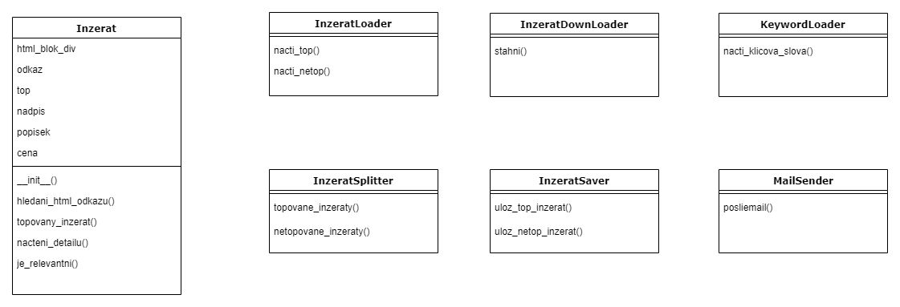

# Sevilla
Program na monitorování inzerátu podle klíčových slov z SBazaru.

## Prerekvizity
Python 3

## Konfigurace
V souboru `config.json` se nastavuje konkrétní url z SBazaru, odesílání emailů a klíčová slova pro filtrování inzerátů.
* URL
* Odesilatel emailů
* Heslo ke schránce odesilatele
* Příjemce emailů
* SMTP server
* Klíčová slova, která je lepší zadávat bez přípon (např. místo 'rozbitý' jen 'rozbit')

## Spuštění
```
python run.py
```
## Proces Diagram


## Class Diagram

